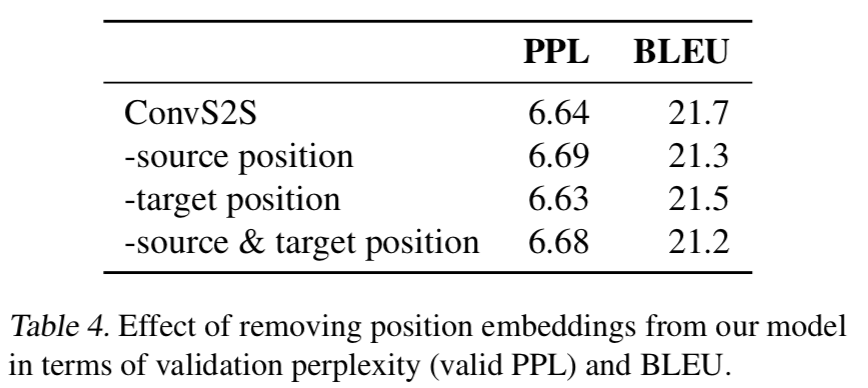

Compared to basic RNN model, attention has two difference:

- instead of just taking the last hidden state, attention takes all the hidden states from the source
- at each time step to generate a target word, decoder gonna look at all the inputs (hidden states of encoder) and decide which are important. So this ends up  an alignment problem

---

[Youtube explaination by Yannic Kilcher](https://www.youtube.com/watch?v=iDulhoQ2pro)

In this video, he explains the core of Transformer model:

- Attention of encoder builds **key-value** pairs in which keys describe what is important and interesting in the source sentence and values tell the corresponding features

- Attention of decoder builds **queries** to ask some information that would be useful in generating the next target word

- Dot production between Q (query) and K (key) in Attention Equation (Attention(Q,K,V) = softmax(QK^T/(dk)^(1/2))V) is like getting the value of what the query wants to know about ceratin key

Also, he talks about the difference between traditional seq2seq model and attention model: 'Different from traditional rnn sequence to sequence model in which a whole sentence is one sample because this is when we do back propagation, in attention model, every generated new token is a sample. And **in attention model, when we generate a new token, basically, it like we input the entire source sentence to encoder, and put previous generated target tokens to decoder.**'

---

[An Introduction to Attention](https://towardsdatascience.com/an-introduction-to-attention-transformers-and-bert-part-1-da0e838c7cda)

This article argues two main drawbacks of sequentail model and how attention model solves these. 

- **strict sequential**. In language, orders are not so important. However, the vanilla encoder-decoder structure parses every item in an input sequence and uses the last hidden state represents the context of the entire sequence. This is where (order) LSTMs and GRUs helped in a big way by providing a way to carry relevant information from one step to next step. Bidirectional RNNs provides mechanism to look both direction. All of these address the “strictly sequential” problem

- **long distance dependence**. This drawback makes sense intuitively. The longer the input sequence length the more difficult it is for the hidden vector to capture the context. To solve this we should get rid of using just the last hidden state as a proxy for the entire sentence and build an architecture that consumes all hidden states. That is what attention mechanism dose.

---

[The Annotated Transformer by Harvardnlp](http://nlp.seas.harvard.edu/2018/04/03/attention.html)

This post presents an “annotated” version of the paper in the form of a line-by-line implementation. 

By far, I've discovered there is one modification from original paper to 

> class SublayerConnection

The output of sublayer should be LayerNorm(x+Sublayer(x)). However, in this post, for code simplicity, the output is x + Sublayer(LayerNorm(x))

---

### Position Embeddings 

In this paper --[Convolutional Sequence to Sequence Learning](https://arxiv.org/abs/1705.03122)

section3.1 introduces position embeddings which is the simple concatenation of pure word embedding and position representations. *Position embeddings are useful in our architecure since they give our model a sense of which portion of the sequence in the input or output it is currently dealing with.* Just like how analog signals with different frequency. 

watch [this video](https://www.youtube.com/watch?v=iDulhoQ2pro) 13:48 for more details

section 5.4 shows removing position embeddings from encoder or decoder does not largely decrease accuracy. Also, the length of the output sequences with or without position embeddings closely matches. This indicates that the model can learn relative position information within the contexts visible to the encoder and decoder networks which can observe up to 27 and 25 words respectively.

---
Background:

Attention mechanism was used primarily in the field of visual imaging, begining in about the 1990s. 

