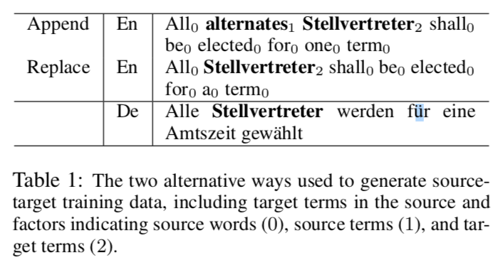

this paper proposes a novel architecture to overcome the conjectural bottleneck of the traditional encoder-decoder architecture, the use of a fixed-length vector. 

There are two commonly used attention functions. The attention mechenism proposed by this paper is also called **additive attention**, and the other is **dot-product (multiplicative) attention** proposed in [Attention is all you need](attention-is-all-you-need.md)

The new architecture consists of:

- **encoder: a bidirectional RNN.** The BiRNN gets *forward hidden states* from forward RNN, gets *backward hidden states* from backward RNN, and then gets *annotations* by simply concatenating these two hidden states. Intuitively, by doing so the *annotations* will contain information of both previous and following content. However, due to the tendency of RNNs to better represent recent inputs, the annotations will be focused on the nearby words.
- **decoder: Alignment Model + RNN.** Compared with previous decoder, the *context vector* is the weighted sum of hidden states of encoder at every step. With this new approach the information can be sprea throughout the sequence of annotations, which can be selectively retrived by the decoder accordingly. 

---

[Paper Summary: Neural Machine Translation by Jointly Learning to Align and Translate](https://medium.com/@hyponymous/paper-summary-neural-machine-translation-by-jointly-learning-to-align-and-translate-84970177e08c)

This article describes the model to understand easilier.

