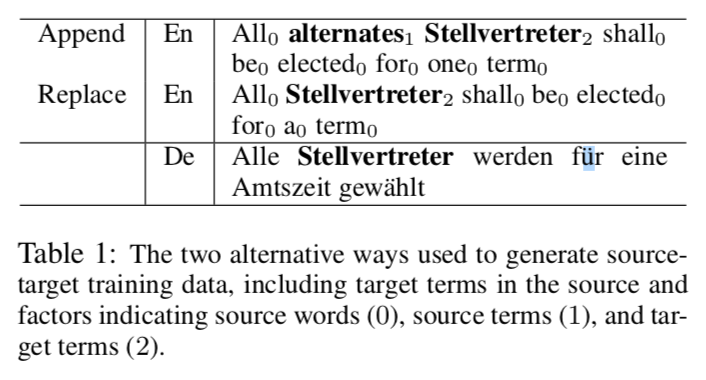

**The problem tries to tackle**: inject custom terminology into NMT *at run time*.

**Methods**:

- Modify decoding algorithm 
  - Cons: add significant computational overhead to the inference step
- Build in-domain corpus
  - Cons: 
    - human add domain knowledge manually and need to update it periodically. NMT system still does not have the ability to learn. 
    - it is not a universally applicable solution as often a domain may be too narrow and lacking in data for such bootstrapping techniques to work.
- Train a NMT system to learn how to use custom terminology when provided with the input. (This paper's approach)

## content

This paper integrates terminology information as inline annotations in the source sentence by two ways:

1. Append the target term to its source versions 
2. directly replace the original term with the target one 

Please note they do not modify the NMT architecure, but wish the network can learn the use of terminology from the augemntation of the training data. 

The hypothesize is that the model will learn to use the inline integrated terminology. In other words, if that is true, when a terminology entry (*t*s, *t*t) is annotated in the source, the target side *t*t is present in the reference. 

see more details at *chapter 2.1 Training data creation*

## Experiments 

Datasets: 

- test dataset: [WMT 2018 English-German news translation tasks](http://www.statmt.org/wmt18/translation-task.html)

- training dataset: 2.2 million sentences, Europarl and news commentary data

Tokenizaiton: Moses, 32K tokens,  joint source and taraget BPT encoding 

Embeddings: shared source and target embeddings 

Network: Transformer, 2 encoding layers and 2 encoding layers

